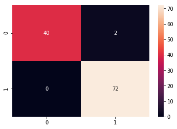

# Breast cancer detection

DataSet from sklearn - https://scikit-learn.org/stable/modules/generated/sklearn.datasets.load_breast_cancer.html

### Co-relation of features from the dataset

### Confusion metric before parameter tuning (97.36 % accuracy)

## Parameter Tuning
In SVM algorithm, we can tune c and gamma parameters to get better results. This sometimes leads to overfitting, when a higher (strictier) C value and a large gamma value is used to fit the model. So in our case, best parameters result obtained by gridSearchCv is `C = 10`, `gamma = 0.01`, which in turned increased the accuracy of the model.

### Confusion metric after parameter(c=10, gamma= 0.01) tuning (97.36 % accuracy)

A note from scikit learn on how C and gamma values affect the classification - 

https://scikit-learn.org/stable/auto_examples/svm/plot_rbf_parameters.html
